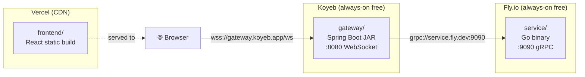

# Deployment Strategy

Free-tier deployment for all three services across three providers with zero cost.

---

## Overview



---

## Service 1 — `frontend/` → Vercel

**Why Vercel:** Free static hosting, auto-deploys on `git push`, global CDN, zero config for Vite projects.

### Deploy Steps
1. Push the repo to GitHub
2. Connect the GitHub repo to [vercel.com](https://vercel.com)
3. Set **Root Directory** → `frontend`
4. Vercel auto-detects Vite — no build command config needed
5. Add environment variable in Vercel dashboard:

| Variable | Value |
|---|---|
| `VITE_GATEWAY_URL` | `wss://your-gateway.koyeb.app/ws` |

### Dockerfile
Not needed — Vercel builds directly from source.

### Notes
- Every push to `main` triggers a new deploy automatically
- Preview deployments are created for every PR
- Custom domain can be added for free

---

## Service 2 — `gateway/` → Koyeb

**Why Koyeb:** Always-on free nano instance (never sleeps), supports WebSocket, Docker-based deploy, Frankfurt + US regions.

### Dockerfile
```dockerfile
FROM maven:3.9-eclipse-temurin-21 AS build
WORKDIR /app
COPY pom.xml .
RUN mvn dependency:go-offline -q
COPY src ./src
RUN mvn package -DskipTests -q

FROM eclipse-temurin:21-jre-alpine
WORKDIR /app
COPY --from=build /app/target/gateway-*.jar app.jar
EXPOSE 8080
ENTRYPOINT ["java", "-jar", "app.jar"]
```

### Environment Variables (set in Koyeb dashboard)
| Variable | Value |
|---|---|
| `GO_SERVICE_HOST` | `your-service.fly.dev` |
| `GO_SERVICE_PORT` | `9090` |
| `SERVER_PORT` | `8080` |

### Deploy Steps
1. Add the `Dockerfile` to `gateway/`
2. Push to GitHub
3. Create a new Koyeb service → **GitHub** source → set build context to `gateway/`
4. Set port to `8080`
5. Add the environment variables above

### Notes
- Koyeb free tier: 1 nano instance (0.1 vCPU, 256 MB RAM) — sufficient for the gateway (stateless relay)
- WebSocket connections are supported natively
- gRPC to Fly.io goes over the public internet (TLS optional for MVP, recommended for production)

---

## Service 3 — `service/` → Fly.io

**Why Fly.io:** Free tier includes 3 always-on shared VMs; supports raw TCP ports for gRPC; low-latency global regions; native Go toolchain support.

### Dockerfile
```dockerfile
FROM golang:1.22-alpine AS build
WORKDIR /app
COPY go.mod go.sum ./
RUN go mod download
COPY . .
RUN go build -o service main.go

FROM alpine:3.19
WORKDIR /app
COPY --from=build /app/service .
EXPOSE 9090
ENTRYPOINT ["./service"]
```

### `fly.toml`
```toml
app = "netcode-service"
primary_region = "sin"       # Singapore — closest to India

[build]
  dockerfile = "Dockerfile"

[[services]]
  internal_port = 9090
  protocol = "tcp"

  [[services.ports]]
    port = 9090
    handlers = ["tls", "http"]   # gRPC runs over HTTP/2
```

### Deploy Steps
1. Install Fly CLI: `winget install Flyio.Flyctl`
2. `flyctl auth login`
3. From `service/` dir: `flyctl launch` (follow prompts, choose region `sin`)
4. `flyctl deploy`
5. Note the assigned hostname: `netcode-service.fly.dev`

### Environment Variables
| Variable | Value |
|---|---|
| `GRPC_PORT` | `9090` |
| `ARENA_W` | `1200` |
| `ARENA_H` | `800` |

### Notes
- Fly.io free tier: 3 shared-cpu-1x 256 MB VMs — more than enough for a Go game server
- Set `min_machines_running = 1` in `fly.toml` to prevent cold starts
- gRPC over port 9090 works out of the box — no special Fly config needed

---

## Cross-Provider Connectivity

The only non-trivial networking concern is the **gateway → service** gRPC call crossing providers.

| Concern | Solution |
|---|---|
| **Discovery** | Fly.io hostname (`netcode-service.fly.dev`) injected into Koyeb as `GO_SERVICE_HOST` env var |
| **Security** | gRPC runs over plain HTTP/2 for MVP; add TLS (Fly.io auto-TLS) before going public |
| **Latency overhead** | ~5–15ms cross-provider overhead (Koyeb Frankfurt → Fly.io Singapore) — acceptable for MVP, revisit if both services move to the same provider |
| **Firewall** | Fly.io exposes port 9090 publicly by default — no extra config needed |

---

## Deploy Checklist

### Before First Deploy
- [ ] `frontend/.env.local` is in `.gitignore` (never committed)
- [ ] `gateway/src/main/resources/application.yml` does **not** hardcode the Go service address
- [ ] `service/main.go` reads `GRPC_PORT` from environment
- [ ] All three `Dockerfile`s are committed to the repo

### Per Deploy
- [ ] Frontend: push to `main` → Vercel auto-deploys
- [ ] Gateway: push to `main` → Koyeb auto-deploys (if GitHub integration enabled)
- [ ] Service: `flyctl deploy` from `service/` directory

### Smoke Test After Deploy
- [ ] `GET https://your-gateway.koyeb.app/health` → `{ "status": "ok" }`
- [ ] `grpcurl -plaintext netcode-service.fly.dev:9090 list` → `game.GameService`
- [ ] Open Vercel URL in browser → canvas loads, WebSocket connects (check DevTools)
- [ ] Open two tabs → both see each other's circles moving

---

## Cost Summary

| Service | Provider | Cost |
|---|---|---|
| `frontend/` | Vercel | **Free** (Hobby plan) |
| `gateway/` | Koyeb | **Free** (Nano instance) |
| `service/` | Fly.io | **Free** (shared-cpu-1x) |
| **Total** | | **\$0/month** |
